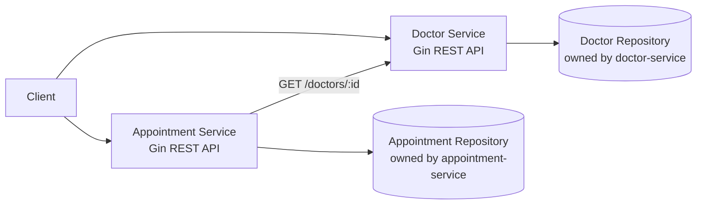

<<<<<<< HEAD
# my-project


## Getting started

To make it easy for you to get started with GitLab, here's a list of recommended next steps.

Already a pro? Just edit this README.md and make it your own. Want to make it easy? [Use the template at the bottom](#editing-this-readme)!

## Add your files

* [Create](https://docs.gitlab.com/user/project/repository/web_editor/#create-a-file) or [upload](https://docs.gitlab.com/user/project/repository/web_editor/#upload-a-file) files
* [Add files using the command line](https://docs.gitlab.com/topics/git/add_files/#add-files-to-a-git-repository) or push an existing Git repository with the following command:

```
cd existing_repo
git remote add origin https://gitlab.com/QosmuratSamat0/my-project.git
git branch -M main
git push -uf origin main
```

## Integrate with your tools

* [Set up project integrations](https://gitlab.com/QosmuratSamat0/my-project/-/settings/integrations)

## Collaborate with your team

* [Invite team members and collaborators](https://docs.gitlab.com/user/project/members/)
* [Create a new merge request](https://docs.gitlab.com/user/project/merge_requests/creating_merge_requests/)
* [Automatically close issues from merge requests](https://docs.gitlab.com/user/project/issues/managing_issues/#closing-issues-automatically)
* [Enable merge request approvals](https://docs.gitlab.com/user/project/merge_requests/approvals/)
* [Set auto-merge](https://docs.gitlab.com/user/project/merge_requests/auto_merge/)

## Test and Deploy

Use the built-in continuous integration in GitLab.

* [Get started with GitLab CI/CD](https://docs.gitlab.com/ci/quick_start/)
* [Analyze your code for known vulnerabilities with Static Application Security Testing (SAST)](https://docs.gitlab.com/user/application_security/sast/)
* [Deploy to Kubernetes, Amazon EC2, or Amazon ECS using Auto Deploy](https://docs.gitlab.com/topics/autodevops/requirements/)
* [Use pull-based deployments for improved Kubernetes management](https://docs.gitlab.com/user/clusters/agent/)
* [Set up protected environments](https://docs.gitlab.com/ci/environments/protected_environments/)

***

# Editing this README

When you're ready to make this README your own, just edit this file and use the handy template below (or feel free to structure it however you want - this is just a starting point!). Thanks to [makeareadme.com](https://www.makeareadme.com/) for this template.

## Suggestions for a good README

Every project is different, so consider which of these sections apply to yours. The sections used in the template are suggestions for most open source projects. Also keep in mind that while a README can be too long and detailed, too long is better than too short. If you think your README is too long, consider utilizing another form of documentation rather than cutting out information.

## Name
Choose a self-explaining name for your project.

## Description
Let people know what your project can do specifically. Provide context and add a link to any reference visitors might be unfamiliar with. A list of Features or a Background subsection can also be added here. If there are alternatives to your project, this is a good place to list differentiating factors.

## Badges
On some READMEs, you may see small images that convey metadata, such as whether or not all the tests are passing for the project. You can use Shields to add some to your README. Many services also have instructions for adding a badge.

## Visuals
Depending on what you are making, it can be a good idea to include screenshots or even a video (you'll frequently see GIFs rather than actual videos). Tools like ttygif can help, but check out Asciinema for a more sophisticated method.

## Installation
Within a particular ecosystem, there may be a common way of installing things, such as using Yarn, NuGet, or Homebrew. However, consider the possibility that whoever is reading your README is a novice and would like more guidance. Listing specific steps helps remove ambiguity and gets people to using your project as quickly as possible. If it only runs in a specific context like a particular programming language version or operating system or has dependencies that have to be installed manually, also add a Requirements subsection.

## Usage
Use examples liberally, and show the expected output if you can. It's helpful to have inline the smallest example of usage that you can demonstrate, while providing links to more sophisticated examples if they are too long to reasonably include in the README.

## Support
Tell people where they can go to for help. It can be any combination of an issue tracker, a chat room, an email address, etc.

## Roadmap
If you have ideas for releases in the future, it is a good idea to list them in the README.

## Contributing
State if you are open to contributions and what your requirements are for accepting them.

For people who want to make changes to your project, it's helpful to have some documentation on how to get started. Perhaps there is a script that they should run or some environment variables that they need to set. Make these steps explicit. These instructions could also be useful to your future self.

You can also document commands to lint the code or run tests. These steps help to ensure high code quality and reduce the likelihood that the changes inadvertently break something. Having instructions for running tests is especially helpful if it requires external setup, such as starting a Selenium server for testing in a browser.

## Authors and acknowledgment
Show your appreciation to those who have contributed to the project.

## License
For open source projects, say how it is licensed.

## Project status
If you have run out of energy or time for your project, put a note at the top of the README saying that development has slowed down or stopped completely. Someone may choose to fork your project or volunteer to step in as a maintainer or owner, allowing your project to keep going. You can also make an explicit request for maintainers.
=======
# Medical Scheduling Platform

This project implements a small two-service medical scheduling platform in Go using Clean Architecture and REST-based microservices.

The system is split into:

- `doctor-service`: owns doctor profile data.
- `appointment-service`: owns appointment data and validates doctor existence through the Doctor Service over HTTP.

## Project Overview

The platform demonstrates:

- separation of concerns inside each service;
- bounded contexts with separate data ownership;
- synchronous REST communication between services;
- basic failure handling when one service depends on another over the network.

Each service keeps business rules in the use case layer, persistence in the repository layer, and HTTP-specific logic in thin Gin handlers.

## Architecture



## Service Responsibilities

### Doctor Service

Owns doctor profile data and exposes:

- `POST /doctors`
- `GET /doctors/:id`
- `GET /doctors`

Rules:

- `full_name` is required.
- `email` is required.
- `email` must be unique.

### Appointment Service

Owns appointment data and exposes:

- `POST /appointments`
- `GET /appointments/:id`
- `GET /appointments`
- `PATCH /appointments/:id/status`

Rules:

- `title` is required.
- `doctor_id` is required.
- the doctor must exist in the Doctor Service;
- `status` must be `new`, `in_progress`, or `done`;
- transition from `done` back to `new` is rejected.

## Folder Structure And Dependency Flow

Each service follows the same shape:

```text
service/
├── cmd/service-name/main.go
└── internal/
    ├── app/            # application wiring
    ├── model/          # domain entities
    ├── repository/     # persistence implementation
    ├── transport/http/ # Gin handlers and DTOs
    └── usecase/        # business logic and interfaces
```

Dependency direction points inward:

- handlers depend on use cases;
- use cases depend on interfaces;
- repositories implement repository interfaces;
- outbound HTTP clients implement use case interfaces;
- domain models do not depend on Gin or transport concerns.

## Inter-Service Communication

The Appointment Service calls the Doctor Service over REST using:

- `GET /doctors/:id`

It performs this validation before:

- creating an appointment;
- updating appointment status.

The Appointment Service never accesses Doctor Service storage directly. This explicit HTTP boundary is what keeps the services decoupled at the data layer and prevents a shared-database design.

## Why This Is Microservices Instead Of A Distributed Monolith

This design qualifies as microservices because:

- each service has its own responsibility and owned data;
- cross-service interaction happens only through a published REST API;
- the Appointment Service depends on a contract, not Doctor Service internals;
- the services can be started, changed, and evolved independently.

It would become a distributed monolith if the services shared one database, reached into each other's repositories, or embedded business rules across process boundaries.

## Why A Shared Database Was Not Used

A shared database would break service ownership and tightly couple both bounded contexts. Instead, each service owns its own repository implementation, and doctor validation crosses the boundary only through an HTTP call. This preserves autonomy and makes the boundary explicit.

## Failure Scenario

If the Doctor Service is unavailable when the Appointment Service tries to create or update an appointment:

- the operation is rejected;
- the Appointment Service logs the verification failure internally;
- the API responds with `503 Service Unavailable` and a descriptive error message.

Current resilience is intentionally basic for the assignment:

- a 2-second timeout is configured on the outbound HTTP client;
- no retry policy is applied;
- no circuit breaker is implemented.

In a production system, retries might help with transient network issues, a circuit breaker would protect the Appointment Service from repeated downstream failures, and richer observability would be added around latency and error rates.

## How To Run

### 1. Install dependencies

From the repository root:

```bash
cd doctor-service && go mod tidy
cd ../appointment-service && go mod tidy
```

To run tests from the repository root, use:

```bash
make test
```

`go test ./...` at the repository root only tests the root launcher module. If you want to run service tests manually without `make`, use:

```bash
cd doctor-service && go test ./...
cd ../appointment-service && go test ./...
```

### 2. Start the Doctor Service

```bash
cd doctor-service
go run ./cmd/doctor-service
```

The Doctor Service runs on `http://localhost:8081`.

### 3. Start the Appointment Service

In another terminal:

```bash
cd appointment-service
DOCTOR_SERVICE_URL=http://localhost:8081 go run ./cmd/appointment-service
```

The Appointment Service runs on `http://localhost:8082`.

### Optional: start both services from the repository root

```bash
go run .
```

This launches both services as child processes:

- Doctor Service on `http://localhost:8081`
- Appointment Service on `http://localhost:8082`

## API Examples

### Create a doctor

```bash
curl -X POST http://localhost:8081/doctors \
  -H "Content-Type: application/json" \
  -d '{
    "full_name": "Dr. Aisha Seitkali",
    "specialization": "Cardiology",
    "email": "a.seitkali@clinic.kz"
  }'
```

### List doctors

```bash
curl http://localhost:8081/doctors
```

### Create an appointment

```bash
curl -X POST http://localhost:8082/appointments \
  -H "Content-Type: application/json" \
  -d '{
    "title": "Initial cardiac consultation",
    "description": "Patient referred for palpitations and shortness of breath",
    "doctor_id": "doctor-1"
  }'
```

### List appointments

```bash
curl http://localhost:8082/appointments
```

### Update appointment status

```bash
curl -X PATCH http://localhost:8082/appointments/appointment-1/status \
  -H "Content-Type: application/json" \
  -d '{
    "status": "in_progress"
  }'
```

## Notes

- Both services currently use in-memory repositories to keep the assignment focused on architecture and service boundaries.
- The in-memory data is reset on restart.
>>>>>>> 31d306b (first commit)
