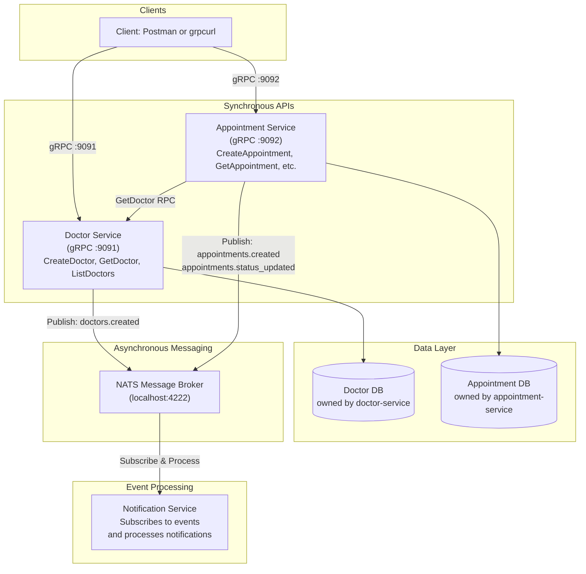

# Medical Scheduling Platform

This project implements a three-service medical scheduling platform in Go using Clean Architecture and microservices patterns.

The system is split into:

- **doctor-service**: owns doctor profile data and publishes events via NATS.
- **appointment-service**: owns appointment data and validates doctor existence through Doctor Service over gRPC. Also publishes events via NATS.
- **notification-service**: subscribes to events from other services via NATS and processes notifications.

## Project Overview

The platform demonstrates:

- separation of concerns inside each service;
- bounded contexts with separate data ownership;
- synchronous gRPC communication between services;
- asynchronous event-driven communication via NATS;
- basic failure handling when services depend on each other over the network.

Each service keeps business rules in the use case layer, persistence in the repository layer, and transport-specific logic in thin gRPC handlers.

## Architecture



## Service Responsibilities

### Doctor Service RPCs

- CreateDoctor
- GetDoctor
- ListDoctors

Rules:

- full_name is required.
- email is required.
- email must be unique.

Events Published:

- `doctors.created`: emitted when a new doctor is created.

### Appointment Service RPCs

- CreateAppointment
- GetAppointment
- ListAppointments
- UpdateAppointmentStatus

Rules:

- title is required.
- doctor_id is required.
- the doctor must exist in Doctor Service;
- status must be new, in_progress, or done;
- transition from done back to new is rejected.

Events Published:

- `appointments.created`: emitted when a new appointment is created.
- `appointments.status_updated`: emitted when appointment status changes.

### Notification Service

Subscribes to events from Doctor Service and Appointment Service via NATS and processes notifications.

Subscribed Events:

- `doctors.created`: notifies about new doctors.
- `appointments.created`: notifies about new appointments.
- `appointments.status_updated`: notifies about appointment status changes.

## Folder Structure And Dependency Flow

Each service follows the same shape:

```text
service/
├── cmd/service-name/main.go
└── internal/
    ├── app/             # application wiring
    ├── logger/          # logging interface (notification-service specific)
    ├── model/           # domain entities
    ├── repository/      # persistence implementation (doctor/appointment services)
    ├── subscriber/      # event subscriber implementation (notification-service specific)
    ├── transport/       # gRPC/HTTP handlers
    └── usecase/         # business logic and interfaces
```

Dependency direction points inward:

- handlers depend on use cases;
- use cases depend on interfaces;
- repositories implement repository interfaces;
- outbound gRPC clients implement use case interfaces;
- domain models do not depend on transport concerns.

## Inter-Service Communication

### Synchronous (gRPC)

Appointment Service calls Doctor Service over gRPC with GetDoctor before:

- creating an appointment;
- updating appointment status.

Appointment Service never accesses Doctor Service storage directly. This explicit RPC boundary keeps services decoupled at the data layer.

### Asynchronous (NATS)

- Doctor Service publishes `doctors.created` events when new doctors are created.
- Appointment Service publishes `appointments.created` and `appointments.status_updated` events for appointment state changes.
- Notification Service subscribes to these events and processes them asynchronously without blocking the originating services.

This decouples notification logic from core business operations.

## Failure Scenario

### gRPC (Synchronous)

If Doctor Service is unavailable when Appointment Service tries to create or update an appointment:

- the operation is rejected;
- Appointment Service logs verification failure internally;
- gRPC returns Unavailable with a descriptive message.

Current resilience is intentionally basic for the assignment:

- a 2-second timeout is configured on outbound gRPC client;
- no retry policy is applied;
- no circuit breaker is implemented.

### NATS (Asynchronous)

If NATS is unavailable when Doctor Service or Appointment Service tries to publish an event:

- the service gracefully handles the error;
- the core operation (create doctor/appointment) still succeeds;
- events may be lost if publishing fails (no persistent queue).

If Notification Service loses connection to NATS:

- it attempts to reconnect with exponential backoff (max 10 retries, up to 32 seconds);
- events published during disconnection are not replayed (fire-and-forget model);
- the service logs connection failures for debugging.

## REST vs gRPC Trade-Offs

1. Contract strictness and type safety
   - gRPC uses proto schemas and generated types, reducing request-shape drift.
   - REST with JSON is more flexible but easier to break without strict validation.
   - Choose gRPC for strongly typed internal service-to-service APIs.

2. Performance and payload format
   - gRPC uses protobuf (binary), usually smaller and faster than JSON in REST.
   - REST is simpler to inspect manually and easier for public browser-facing APIs.
   - Choose gRPC for low-latency internal calls and high-throughput paths.

3. Streaming and bidirectional communication
   - gRPC natively supports client/server/bidirectional streaming.
   - REST usually needs extra protocols (SSE/WebSocket) for real-time patterns.
   - Choose gRPC when your use case needs streaming semantics.

4. Tooling and interoperability
   - REST is universally accessible with plain HTTP tooling.
   - gRPC requires proto-aware tooling (Postman gRPC mode, grpcurl, generated clients).
   - Choose REST for broad external integrations, gRPC for controlled internal ecosystems.

## Prerequisites

- Go 1.25+
- protoc compiler
- protoc-gen-go plugin
- protoc-gen-go-grpc plugin
- Docker and Docker Compose (for running the full stack with PostgreSQL and NATS)

### Install protoc and plugins

Windows (example with winget):

```powershell
winget install ProtocolBuffers.Protobuf
go install google.golang.org/protobuf/cmd/protoc-gen-go@latest
go install google.golang.org/grpc/cmd/protoc-gen-go-grpc@latest
```

Linux/macOS:

```bash
# install protoc with your package manager first
go install google.golang.org/protobuf/cmd/protoc-gen-go@latest
go install google.golang.org/grpc/cmd/protoc-gen-go-grpc@latest
```

Ensure Go bin is in PATH so protoc can find plugins.

## Regenerate gRPC Stubs

From repository root:

```bash
make proto-doctor
make proto-appointment
```

Or run protoc commands directly from each service folder as defined in Makefile.

## How To Run

### 1. Install service dependencies

From repository root:

```bash
cd doctor-service && go mod tidy
cd ../appointment-service && go mod tidy
```

### 2. Start Doctor Service (gRPC)

```bash
cd doctor-service
go run ./cmd/doctor-service
```

Doctor Service gRPC listens on localhost:9091.

### 3. Start Appointment Service (gRPC)

In another terminal:

Linux/macOS:

```bash
cd appointment-service
DOCTOR_SERVICE_ADDR=localhost:9091 go run ./cmd/appointment-service
```

PowerShell:

```powershell
cd appointment-service
$env:DOCTOR_SERVICE_ADDR = "localhost:9091"
go run ./cmd/appointment-service
```

Appointment Service gRPC listens on localhost:9092.

### Optional: start both services from repository root

```bash
go run .
```

This launches:

- Doctor Service gRPC on localhost:9091
- Appointment Service gRPC on localhost:9092
- Notification Service subscribing to NATS at localhost:4222

### 4. Start Notification Service

In another terminal:

```bash
cd notification-service
go run ./cmd/notification
```

Notification Service will connect to NATS at localhost:4222 (configurable via NATS_URL environment variable).

## gRPC Testing Artifact (grpcurl)

These commands demonstrate all RPCs required by the assignment.

### Doctor Service

CreateDoctor:

```bash
grpcurl -plaintext \
  -import-path doctor-service/proto \
  -proto doctor.proto \
  -d '{"full_name":"Dr. Aisha Seitkali","specialization":"Cardiology","email":"a.seitkali@clinic.kz"}' \
  localhost:9091 doctor.DoctorService/CreateDoctor
```

GetDoctor:

```bash
grpcurl -plaintext \
  -import-path doctor-service/proto \
  -proto doctor.proto \
  -d '{"id":"doctor-1"}' \
  localhost:9091 doctor.DoctorService/GetDoctor
```

ListDoctors:

```bash
grpcurl -plaintext \
  -import-path doctor-service/proto \
  -proto doctor.proto \
  -d '{}' \
  localhost:9091 doctor.DoctorService/ListDoctors
```

### Appointment Service

CreateAppointment:

```bash
grpcurl -plaintext \
  -import-path appointment-service/proto \
  -proto appointment.proto \
  -d '{"title":"Initial cardiac consultation","description":"Patient referred for palpitations","doctor_id":"doctor-1"}' \
  localhost:9092 appointment.AppointmentService/CreateAppointment
```

GetAppointment:

```bash
grpcurl -plaintext \
  -import-path appointment-service/proto \
  -proto appointment.proto \
  -d '{"id":"appointment-1"}' \
  localhost:9092 appointment.AppointmentService/GetAppointment
```

ListAppointments:

```bash
grpcurl -plaintext \
  -import-path appointment-service/proto \
  -proto appointment.proto \
  -d '{}' \
  localhost:9092 appointment.AppointmentService/ListAppointments
```

UpdateAppointmentStatus:

```bash
grpcurl -plaintext \
  -import-path appointment-service/proto \
  -proto appointment.proto \
  -d '{"id":"appointment-1","status":"in_progress"}' \
  localhost:9092 appointment.AppointmentService/UpdateAppointmentStatus
```

## Notes

- Both services currently use in-memory repositories to keep focus on architecture and service boundaries.
- In-memory data is reset on restart.
