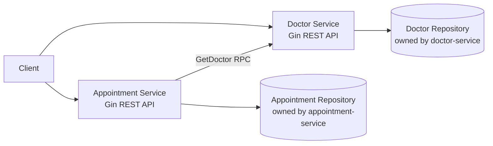

# Medical Scheduling Platform

This project implements a small two-service medical scheduling platform in Go using Clean Architecture and HTTP/gRPC microservices.

The system is split into:

- `doctor-service`: owns doctor profile data.
- `appointment-service`: owns appointment data and validates doctor existence through the Doctor Service over gRPC.

## Project Overview

The platform demonstrates:

- separation of concerns inside each service;
- bounded contexts with separate data ownership;
- synchronous gRPC communication between services;
- basic failure handling when one service depends on another over the network.

Each service keeps business rules in the use case layer, persistence in the repository layer, and transport-specific logic in thin handlers.

## Architecture



## Service Responsibilities

### Doctor Service

Owns doctor profile data and exposes:

- `POST /doctors`
- `GET /doctors/:id`
- `GET /doctors`

Rules:

- `full_name` is required.
- `email` is required.
- `email` must be unique.

### Appointment Service

Owns appointment data and exposes:

- `POST /appointments`
- `GET /appointments/:id`
- `GET /appointments`
- `PATCH /appointments/:id/status`

Rules:

- `title` is required.
- `doctor_id` is required.
- the doctor must exist in the Doctor Service;
- `status` must be `new`, `in_progress`, or `done`;
- transition from `done` back to `new` is rejected.

## Folder Structure And Dependency Flow

Each service follows the same shape:

```text
service/
├── cmd/service-name/main.go
└── internal/
    ├── app/            # application wiring
    ├── model/          # domain entities
    ├── repository/     # persistence implementation
    ├── transport/http/ # Gin handlers and DTOs
    └── usecase/        # business logic and interfaces
```

Dependency direction points inward:

- handlers depend on use cases;
- use cases depend on interfaces;
- repositories implement repository interfaces;
- outbound transport clients implement use case interfaces;
- domain models do not depend on Gin or transport concerns.

## Inter-Service Communication

The Appointment Service calls the Doctor Service over gRPC using:

- `GetDoctor`

It performs this validation before:

- creating an appointment;
- updating appointment status.

The Appointment Service never accesses Doctor Service storage directly. This explicit RPC boundary is what keeps the services decoupled at the data layer and prevents a shared-database design.

## Why This Is Microservices Instead Of A Distributed Monolith

This design qualifies as microservices because:

- each service has its own responsibility and owned data;
- cross-service interaction happens only through a published gRPC API;
- the Appointment Service depends on a contract, not Doctor Service internals;
- the services can be started, changed, and evolved independently.

It would become a distributed monolith if the services shared one database, reached into each other's repositories, or embedded business rules across process boundaries.

## Why A Shared Database Was Not Used

A shared database would break service ownership and tightly couple both bounded contexts. Instead, each service owns its own repository implementation, and doctor validation crosses the boundary only through a gRPC call. This preserves autonomy and makes the boundary explicit.

## Failure Scenario

If the Doctor Service is unavailable when the Appointment Service tries to create or update an appointment:

- the operation is rejected;
- the Appointment Service logs the verification failure internally;
- the API responds with `503 Service Unavailable` and a descriptive error message.

Current resilience is intentionally basic for the assignment:

- a 2-second timeout is configured on the outbound gRPC client;
- no retry policy is applied;
- no circuit breaker is implemented.

In a production system, retries might help with transient network issues, a circuit breaker would protect the Appointment Service from repeated downstream failures, and richer observability would be added around latency and error rates.

## How To Run

### 1. Install dependencies

From the repository root:

```bash
cd doctor-service && go mod tidy
cd ../appointment-service && go mod tidy
```

To run tests from the repository root, use:

```bash
make test
```

`go test ./...` at the repository root only tests the root launcher module. If you want to run service tests manually without `make`, use:

```bash
cd doctor-service && go test ./...
cd ../appointment-service && go test ./...
```

### 2. Start the Doctor Service

```bash
cd doctor-service
go run ./cmd/doctor-service
```

The Doctor Service runs on `http://localhost:8081`.

### 3. Start the Appointment Service

In another terminal:

```bash
cd appointment-service
DOCTOR_SERVICE_ADDR=localhost:9091 go run ./cmd/appointment-service
```

The Appointment Service runs on `http://localhost:8082`.

### Optional: start both services from the repository root

```bash
go run .
```

This launches both services as child processes:

- Doctor Service on `http://localhost:8081`
- Appointment Service on `http://localhost:8082`

## API Examples

### Create a doctor

```bash
curl -X POST http://localhost:8081/doctors \
  -H "Content-Type: application/json" \
  -d '{
    "full_name": "Dr. Aisha Seitkali",
    "specialization": "Cardiology",
    "email": "a.seitkali@clinic.kz"
  }'
```

### List doctors

```bash
curl http://localhost:8081/doctors
```

### Create an appointment

```bash
curl -X POST http://localhost:8082/appointments \
  -H "Content-Type: application/json" \
  -d '{
    "title": "Initial cardiac consultation",
    "description": "Patient referred for palpitations and shortness of breath",
    "doctor_id": "doctor-1"
  }'
```

### List appointments

```bash
curl http://localhost:8082/appointments
```

### Update appointment status

```bash
curl -X PATCH http://localhost:8082/appointments/appointment-1/status \
  -H "Content-Type: application/json" \
  -d '{
    "status": "in_progress"
  }'
```

## Notes

- Both services currently use in-memory repositories to keep the assignment focused on architecture and service boundaries.
- The in-memory data is reset on restart.
>>>>>>> 31d306b (first commit)
