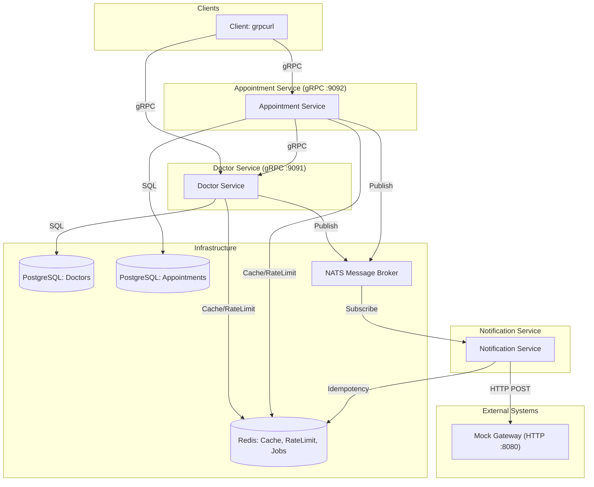

# Medical Scheduling Platform — Assignment 4

This project is an extension of the Medical Scheduling Platform, adding production-readiness features: Redis-backed caching, rate limiting, and background job processing with idempotency and retry logic.

## Project Overview

In this version (Assignment 4), we have introduced:
- **Redis Caching**: Reducing database load and latency for read operations in Doctor and Appointment services.
- **Rate Limiting**: Protecting gRPC endpoints using a Redis-backed sliding-window rate limiter.
- **Background Job Queue**: Asynchronous processing of appointment completion notifications in the Notification Service with a worker pool, retry logic, and idempotency.
- **Mock Notification Gateway**: A simulated external API to verify notification delivery and retry behavior.

## Architecture



## Caching Strategies

| Service | Operation | Strategy | Key Pattern | TTL | Rationale |
| --- | --- | --- | --- | --- | --- |
| Doctor | GetDoctor | Cache-Aside | `doctor:<id>` | 60s | Classic read-through to reduce DB hits for profile lookups. |
| Doctor | ListDoctors | Cache-Aside | `doctors:list` | 60s | Cached list for high-frequency reads. |
| Doctor | CreateDoctor | Write-Through | `doctors:list` | N/A | Invalidate the list immediately to ensure consistency for the next List call. |
| Appointment | GetAppointment | Cache-Aside | `appointment:<id>` | 60s | Reduces DB load for appointment status checks. |
| Appointment | ListAppointments | Cache-Aside | `appointments:list` | 60s | Cached list for overview screens. |
| Appointment | CreateAppointment | Write-Around | `appointments:list` | N/A | Invalidate the list key so the next List call fetches fresh data. |
| Appointment | UpdateStatus | Write-Through | `appointment:<id>`, `appointments:list` | N/A | Update the specific appointment in cache and invalidate the list. |

### Cache Invalidation
- Invalidation occurs after a successful database write but before returning the gRPC response.
- Invalidation is "best-effort"; failures are logged but do not block the response.
- A cache miss transparently falls through to the database.

## Rate Limiting
- **Algorithm**: Sliding Window Counter.
- **Implementation**: gRPC `UnaryServerInterceptor`.
- **Backing Store**: Redis (`INCR` with minute-based keys).
- **Default Limit**: 100 requests per minute (RPM) per client IP.
- **Configurable**: via `RATE_LIMIT_RPM` environment variable.
- **Behavior**: Returns `codes.ResourceExhausted` when the limit is exceeded.

## Background Job Queue
Implemented as an in-process worker pool in the Notification Service using Go channels and goroutines.

- **Trigger**: `appointments.status_updated` event where `new_status = "done"`.
- **Worker Pool**: Configurable size via `WORKER_POOL_SIZE` (default: 3).
- **Idempotency**: 
    - Key: `SHA-256(event_type + id + occurred_at)`.
    - Store: Redis with 24-hour TTL.
    - Prevents duplicate processing of the same event.
- **Retry Logic**: 
    - Max 3 attempts.
    - Exponential backoff (1s, 2s, 4s).
    - Triggered by transient errors (HTTP 503) from the gateway or network failures.
- **Dead-Letter Log**: 
    - After 3 failed attempts, the job is logged to `stderr` as structured JSON.

## Environment Variables

| Variable | Example | Purpose |
| --- | --- | --- |
| `REDIS_URL` | `redis://localhost:6379` | Redis connection string |
| `CACHE_TTL_SECONDS` | `60` | Default cache TTL |
| `RATE_LIMIT_RPM` | `100` | Max requests per minute per IP |
| `GATEWAY_URL` | `http://localhost:8080` | Mock Notification Gateway URL |
| `WORKER_POOL_SIZE` | `3` | Number of background workers |

## Service Startup Order

1. **Infrastructure**: Start Redis, PostgreSQL, and NATS.
2. **Mock Gateway**:
   ```bash
   cd mock-gateway && go run .
   ```
3. **Doctor Service**:
   ```bash
   cd doctor-service && go run ./cmd/doctor-service
   ```
4. **Appointment Service**:
   ```bash
   cd appointment-service && go run ./cmd/appointment-service
   ```
5. **Notification Service**:
   ```bash
   cd notification-service && go run ./cmd/notification
   ```

## Testing Artifact (grpcurl)

### Checkpoint 1: Cache Hit
```bash
# Call twice; verify Redis MONITOR shows GET miss then SET, then GET hit.
grpcurl -plaintext -import-path doctor-service/proto -proto doctor.proto -d '{"id":"<UUID>"}' localhost:9091 doctor.DoctorService/GetDoctor
```

### Checkpoint 2: Rate Limiter
```bash
# Send many requests rapidly; verify ResourceExhausted error.
for ($i=1; $i -le 110; $i++) { grpcurl -plaintext -import-path doctor-service/proto -proto doctor.proto -d '{}' localhost:9091 doctor.DoctorService/ListDoctors }
```

### Checkpoint 3: Job Queue & Gateway
```bash
# Update status to done
grpcurl -plaintext -import-path appointment-service/proto -proto appointment.proto -d '{"id":"<UUID>", "status":"done"}' localhost:9092 appointment.AppointmentService/UpdateAppointmentStatus
```
Observe Notification Service logs:
- `{"status":"enqueued", ...}`
- `{"status":"processing", ...}`
- `{"status":"success", ...}`

### Checkpoint 4: Idempotency
Manually publish the same event to NATS. Notification Service should log:
- `{"status":"dropped_duplicate", ...}`

### Checkpoint 5: Dead Letter
Stop Mock Gateway and trigger a `done` status update. Observe 3 retries then:
- `{"status":"dead_letter", ...}` in stderr.

## Consistency & Trade-offs
- **Redis Unavailability**: Services log a warning and fallback to DB. Caching is best-effort.
- **Eventual Consistency**: List caches are invalidated on write, but there's a micro-window where a stale read might occur if invalidation fails.
- **Distributed Rate Limiting**: Redis-backed counting solves the "horizontal scaling" issue where per-instance counters would allow `N * Limit` requests.
